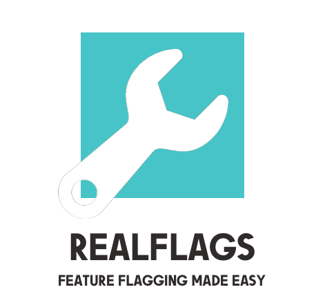

<p align="center">
<picture>
 <source media="(prefers-color-scheme: dark)" srcset="./documentation/assets/realflags-dark.png" width="350">
 
</picture>
</p>

RealFlags makes it **easy to configure feature flags**in your codebase. 
It's designed for Swift and **provides a simple and elegant abstraction layer** over multiple providers you can query with your priority. 
It also has a **handy UI tool to browse and alter values directly at runtime!**

<br/>
<p align="center">
<b><a href="#features-highlights">Features</a></b>
|
<b><a href="#what-you-get">What You Get</a></b>
|
<b><a href="#flags-browser--editor">Flags Browser & Editor</a></b>
|
<b><a href="#tests">Tests</a></b>
|
<b><a href="#documentation">Documentation</a></b>
|
<b><a href="#requirements">Requirements</a></b>
|
<b><a href="#installation">Installation</a></b>
|
<b><a href="#powered-apps">Powered Apps</a></b>
|
<b><a href="#support">Support & Contribute</a></b>
|
<b><a href="#license">License</a></b>
</p>
<br/>

## Features Highlights

- 💡 **Simple & Elegant**: Effectively describe and organize your own flags with a type-safe structure. It will abstract your implementation and consistently reduce the amount of code to manage your feature flags
- 💡 **Extensible**: You can use one of the default data providers or create your own. We support Firebase Remote and Local configurations too
- 💡 **Complete**: Feature Flags support all primitive datatypes and complex objects: `Int` (and any numeric variant), `String`, `Bool`, `Data`, `Date`, `URL`, `Dictionary`, `Array` (values must conform to `FlagProtocol`), Optional Values and virtually any object conform to `Codable` protocol!
- 💡 **Configurable**: Enable, disable and customize features at runtime
- 💡 **Integrated UI Tool**: the handy UI Tool allows you to customize and read flags at a glance

## An Hands-on Approach

Would you use RealFlags in your product? We wrote an article about it. 
**Check it out [here](https://www.offnotes.org/feature-flags/)**

## What You Get

Our goal in making RealFlags is to provide a type-safe abstract way to describe and query for feature flags.

The first step is to describe your collection of flags:

```swift
// Define the structure of your feature flags with type-safe properties!
struct UserFlags: FlagCollectionProtocol {
 @Flag(default: true, description: "Show social login options along native login form")
 var showSocialLogin: Bool
 
 @Flag(default: 0, description: "Maximum login attempts before blocking account")
 var maxLoginAttempts: Int
 
 @Flag(key: "rating_mode", default: "at_launch", description: "The behaviour to show the rating popup")
 var appReviewRating: String

 public init() {}
}
```

This represents a type-safe description of some flags grouped in a collection. 
Each feature flags property is identified by the `@Flag` annotation. 
It's time load values for this collection; using a new `FlagsLoader` you will be able to load and query collection's values from one or more data providers:

```swift
// Allocate your own data providers
let localProvider = LocalProvider(localURL: fileURL)
let fbProvider = FirebaseRemoteProvider()

// Loader is the point for query values
let userFlagsLoader = FlagsLoader(UserFlags.self, // load flags definition
 description: .init(name: "User Features", description: "Cool experimental features for user account"),
 providers: [fbProvider, localProvider]) // set providers
```

Now you can query values from `userFlagsLoader` by using the `UserFlags` structure (it supports autocomplete and type-safe values thanks to `@dynamicMemberLookup`!). 
Let me show it:

```swift
if userFlagsLoader.showSocialLogin { // query properties as type-safe with autocomplete!
 // do some stuff
}
```

Values are obtained respecting the order you have specified, in this case from Firebase Remote Config service, then, when no value is found, into the local repository. 
If no values are available, the default value specified in `@Flags` annotation is returned.

This is just an overview of the library; if you want to know more, follow the [documentation below](#documentation).

## Flags Browser & Editor

RealFlags also comes with a handy tool you can use to browse and edit feature flag values directly in your client! It can be helpful for testing purposes or allow product owners to enable/disable and verify features of the app.

[Checkout the doc for more infos!](./documentation/advanced_usage.md#3.5)


https://user-images.githubusercontent.com/235645/150638946-99646e96-d155-451f-a723-585ad7978c43.mp4

## API Reference

RealFlags is fully documented at the source-code level. You'll get autocomplete with doc inside XCode for free; moreover, you can read the full Apple's DoCC Documentation automatically generated thanks to [**Swift Package Index**](https://swiftpackageindex.com) Project from here:

👉 [API REFERENCE](https://swiftpackageindex.com/immobiliare/RealFlags)

## Documentation

The following documentation describes detailed usage of the library.

- 1.0 - [Introduction](./documentation/introduction.md) 
   - 1.1 - [@Flag Annotation](./documentation/introduction.md#11-flag-annotation)
   - 1.2 - [@Flag Supported Datatypes](./documentation/introduction.md#12--flag-supported-data-types)
   - 1.3 - [`Codable` types and `@Flag`](#13-codable-types-and--flag)
   - 1.4 - [Computed @Flag](./documentation/introduction.md#14-computed--flag)
   - 1.5 - [Load a Feature Flag Collection in a `FlagLoader`](./documentation/introduction.md#15-load-a-feature-flag-collection-in-a-flagloader)
   - 1.6 - [Configure Key Evaluation for `FlagsLoader`'s `@Flag`](./documentation/introduction.md#16-configure-key-evaluation-for-flagsloaders-flag)
   - 1.7 - [Query a specific data provider](./documentation/introduction.md#17-query-a-specific-data-provider) 
   - 1.8 - [Set Flag defaultValue at runtime](./documentation/introduction.md#18-set-flag-defaultvalue-at-runtime)
   - 1.9 - [Reset Flag values](./documentation/introduction.md#19-reset-flag-values)
   - 1.10 - [Reset LocalProvider values](./documentation/introduction.md#110-reset-localprovider-values)
- 2.0 - [Organize Feature Flags](./documentation/organize_feature_flags.md) 
   - 2.1 - [The `@FlagCollection` annotation](./documentation/organize_feature_flags.md#21-the-flagcollection-annotation)
   - 2.2 - [Nested Structures](./documentation/organize_feature_flags.md#22-nested-structures)
   - 2.3 - [Configure `FlagCollection`'s contribution to properties keypath generation](./documentation/organize_feature_flags.md#23-configure-flagcollections-contribution-to-properties-keypath-generation)
- 3.0 - [Advanced Usage](./documentation/advanced_usage.md) 
   - 3.1 - [Using FlagsManager](./documentation/advanced_usage.md#31-using-flagsmanager)
   - 3.2 - [Use and Creation of Data Providers](./documentation/advanced_usage.md#32---use-and-creation-of-data-providers)
   - 3.3 - [Firebase Remote Config with FirebaseRemoteProvider](./documentation/advanced_usage.md#33-firebase-remote-config-with-firebaseremoteprovider)
   - 3.4 - [Modify a feature flag at runtime](./documentation/advanced_usage.md#34-modify-a-feature-flag-at-runtime)
   - 3.5 - [Flags Browser & Editor](./documentation/advanced_usage.md#35-flags-browser--editor)

## Test Suite

RealFlags includes an extensive collection of unit tests: you can find it in the `Tests` directory.
## Requirements

RealFlags can be installed on any platform which supports Swift 5.4+, including Windows and Linux. On Apple platform, the following configuration is required:

- iOS 12+
- Xcode 12.5+
- Swift 5.4+

## Installation

To use RealFlags in your project you can use Swift Package Manager (our primary choice) or CocoaPods.

### Swift Package Manager

Add it as a dependency in a Swift Package, and add it to your `Package.swift`:

```swift
dependencies: [
 .package(url: "https://github.com/immobiliare/RealFlags.git", from: "1.0.0")
]
```

And add it as a dependency of your target:

```swift
targets: [
 .target(name: "MyTarget", dependencies: [
 .product(name: "https://github.com/immobiliare/RealFlags.git", package: "RealFlags")
 ])
]
```

In Xcode 11+, you can also navigate to the File menu and choose Swift Packages -> Add Package Dependency..., then enter the repository URL and version details.

### CocoaPods

RealFlags can be installed with CocoaPods by adding pod 'RealFlags' to your Podfile.

```ruby
pod 'RealFlags' // to import the core framework
pod 'RealFlagsFirebase' // to also import Firebase Data Provider
```

## Powered Apps

The amazing mobile team at ImmobiliareLabs created RealFlags, the Tech dept at Immobiliare.it, the first real estate site in Italy. 
We are currently using RealFlags in all of our products.

**If you are using RealFlags in your app [drop us a message](mailto://mobile@immobiliare.it), we'll add below**.

<a href="https://apps.apple.com/us/app/immobiiiare-it-indomio/id335948517"></a>

## Support

<p align="center">
Made with ❤️ by <a href="https://github.com/orgs/immobiliare">ImmobiliareLabs</a> and <a href="https://github.com/immobiliare/RealFlags/graphs/contributors">Contributors</a>
<br clear="all">
</p>

We'd love for you to contribute to RealFlags! 
If you have questions about using RealFlags, bugs, and enhancement, please feel free to reach out by opening a [GitHub Issue](https://github.com/immobiliare/RealFlags/issues).

## License

RealFlags is licensed under the MIT license. 
See the [LICENSE](./LICENSE) file for more information.

